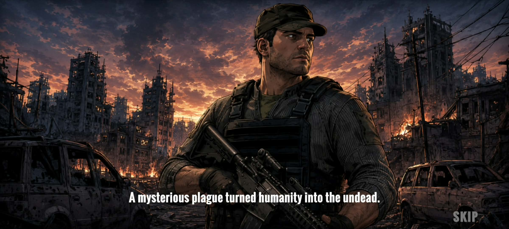
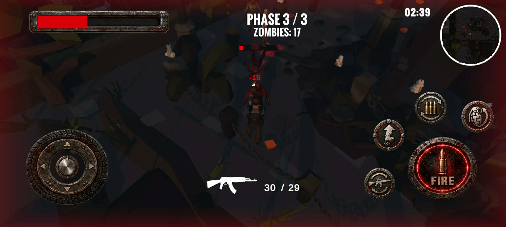
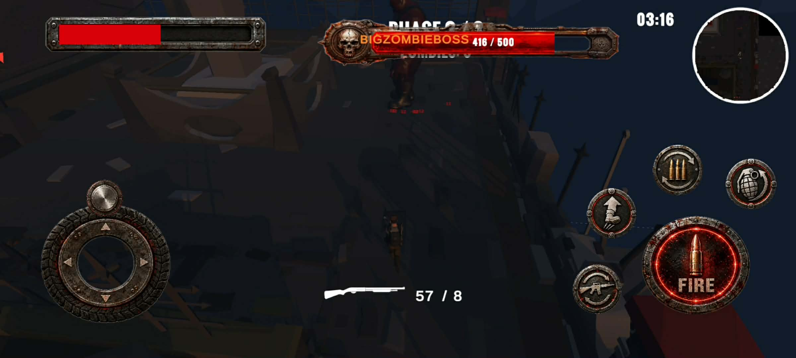

# 🧟 Zombie War

  

  
  

**Game bắn súng sinh tồn góc nhìn thứ ba dành cho mobile**

## 🎮 Giới thiệu

**Zombie War** đưa người chơi vào một thế giới hậu tận thế đầy xác sống.  
Hãy sử dụng súng, bom và kỹ năng di chuyển để vượt qua các đợt zombie, sống sót trong từng khu vực và đánh bại boss cuối màn.

## ✨ Tính năng chính

- 🔫 Chiến đấu bằng **rifle, shotgun và bom**
- 🧟 Nhiều loại zombie với chỉ số và hành vi khác nhau
- 🌊 Hệ thống **wave**, cổng chắn và cảnh báo nguy hiểm
- 👹 Màn đấu boss với camera cinematic, giới thiệu và thanh máu riêng
- 🗺️ Minimap, hiệu ứng nhận sát thương và giao diện mobile
- 🎬 Cutscene cốt truyện, loading scene và hiệu ứng chuyển cảnh
- 🏆 Màn hình thắng/thua, thống kê thời gian, số kill và điểm số
- 🔊 Nhạc nền, âm thanh chiến đấu và tùy chọn chất lượng đồ họa

## 🕹️ Điều khiển

| Biểu tượng | Chức năng |
|---|---|
| 🕹️ | Di chuyển nhân vật |
| 🔥 | Ngắm và bắn |
| 🔄 | Thay đạn |
| 🔫 | Đổi vũ khí |
| 💣 | Ngắm quỹ đạo và ném bom |
| ⬆️ | Nhảy |

## 🚀 Chạy dự án

1. Cài đặt **Unity 2022.3.62f3 LTS**.
2. Clone repository này.
3. Mở thư mục dự án bằng Unity Hub.
4. Mở scene `Assets/Scenes/MainMenu.unity`.
5. Nhấn **Play** để bắt đầu.

## 📱 Nền tảng

Dự án được tối ưu cho **Android ARM64**, sử dụng **IL2CPP** và **OpenGLES3**.

---

**⚔️ Sống sót — Tiêu diệt zombie — Đánh bại boss ⚔️**

